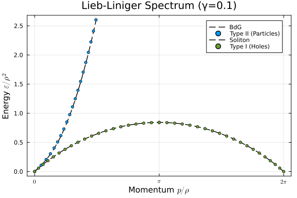

# LiebLinigerBetheAnsatz.jl

`LiebLinigerBetheAnsatz` is an implementation of the Bethe Ansatz solution for the Lieb-Liniger model of interacting bosons in one dimension.

$$
H = \sum_{j=1}^{N} \left[-\frac{\partial^2}{\partial x_j^2} + 2c\sum_{j \lt i} \delta(x_j - x_i)\right]
$$

where $\hbar = 2m = 1$. 

## Installation 

```julia
using Pkg
Pkg.add(url="https://github.com/20akshay00/LiebLinigerBetheAnsatz.jl")
```

## Quickstart

Currently, the package supports computing ground state properties for the following cases:

### 1. Thermodynamic limit

In the thermodynamic limit, the package solves the Lieb-Liniger integral equations. The problem can be specified using either the dimensionless interaction $\gamma = c/\rho$ or the chemical potential $\mu$.

```julia
using LiebLinigerBetheAnsatz

# solve using dimensionless interaction γ = c/ρ
state = solve(InfiniteLLProblem(γ=1.0))

# Alternatively, solve using chemical potential
#state = solve(InfiniteLLProblem(μ=3.0, c=1.0))

ρ_k = quasimomentum_distribution(state)
e = energy_density(state)
n = average_particle_density(state)
```

The excitation spectrum may also be extracted as follows.
<br>

<p align="center">
  
</p>

```julia
# compute Type I (holes) and Type II (particles) excitations
p_h, E_h, p_p, E_p = get_particle_hole_spectrum(state, num_points=20)
```

### 2. Finite system

For systems with a fixed number of particles $N$, the package solves the discrete Bethe Ansatz equations. This supports both periodic and hard-wall boundary conditions.

```julia
using LiebLinigerBetheAnsatz

L, c, N = 10.0, 1.0, 5
# bc = [:periodic, :hardwall]
state = solve(FiniteLLProblem(L, c, N=N, bc=:hardwall))

E = energy(state)
Q = fermi_quasimomentum(state)
```

### 3. Non-uniform systems (LDA)
For systems in an external potential $V(x)$, the package utilizes a Local Density Approximation (LDA) to find the energy and density profile.

```julia
using LiebLinigerBetheAnsatz

V(x) = 0.5x^2
μ, c = 5.0, 10.0
domain = (-5.0, 5.0)

# solve for the non-uniform density profile
state = solve(NonUniformLLProblem(c=c, V=V, μ=μ, domain=domain))

dens = particle_density(state) # returns a function ρ(x)
E_total = energy(state)
```

## Limitations & To-do
- **Correlations:**  $n$-point correlation functions (like $g^{(2)}$) are prohibitively expensive and are not yet implemented.
- **Finite Temperature:** Only $T=0$ ground states and elementary excitations are currently available.
- **Tests:** Expand unit tests for LDA and edge cases in finite systems.